# Auto Explorer

## Descripción general

Auto Explorer es una aplicación desarrollada en Flutter que permite explorar un catálogo de automóviles, consultar información detallada, seleccionar vehículos favoritos y abrir enlaces externos relacionados con cada modelo.

El proyecto fue realizado para la asignatura Programación 4 y corresponde a la continuación de la aplicación desarrollada durante la Actividad Integradora 1.

---

# Actividad Integradora 1

## 1. Descripción

En la Actividad Integradora 1 se desarrolló la primera versión de Auto Explorer. Esta versión permitía visualizar una lista de autos destacados y mostrar información adicional del Nissan GT-R mediante un botón.

El objetivo fue aplicar conceptos básicos de Flutter, utilizar widgets, incorporar una interacción con `setState()`, instalar un paquete externo y publicar el proyecto en GitHub.

---

## 2. Configuración del entorno

Antes de iniciar el proyecto se verificó que Flutter y las herramientas necesarias estuvieran correctamente instaladas mediante el comando:

```bash
flutter doctor
```

El resultado indicó que el entorno se encontraba correctamente configurado.

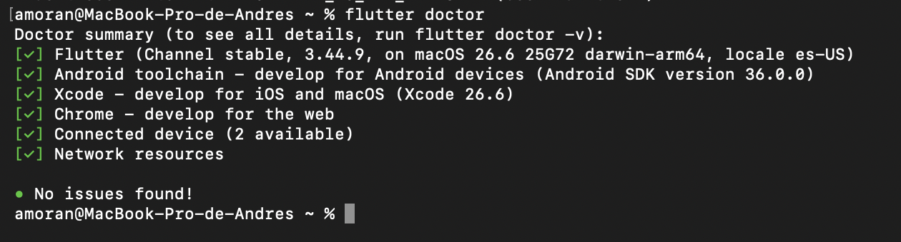

---

## 3. Creación del proyecto Flutter

El proyecto fue creado utilizando Flutter y Visual Studio Code.

Después de crear el proyecto se generó automáticamente la estructura inicial de carpetas y archivos.

### Estructura inicial del proyecto

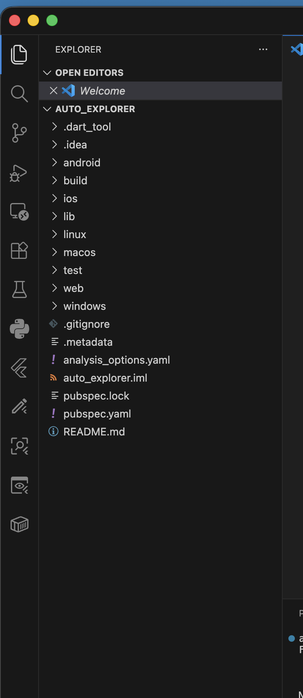

### Primera ejecución

Antes de realizar modificaciones se ejecutó la aplicación inicial de Flutter para comprobar su funcionamiento.

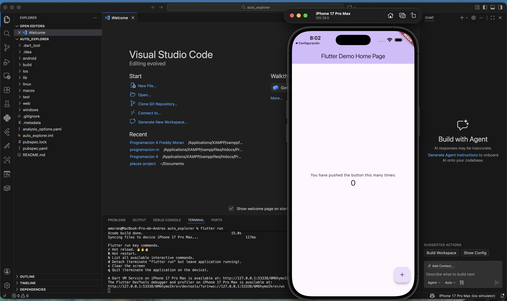

---

## 4. Simulador utilizado

Para desarrollar y probar la aplicación se utilizó el simulador de iOS.

Después de ejecutar el proyecto, Auto Explorer quedó instalado correctamente en el dispositivo virtual.

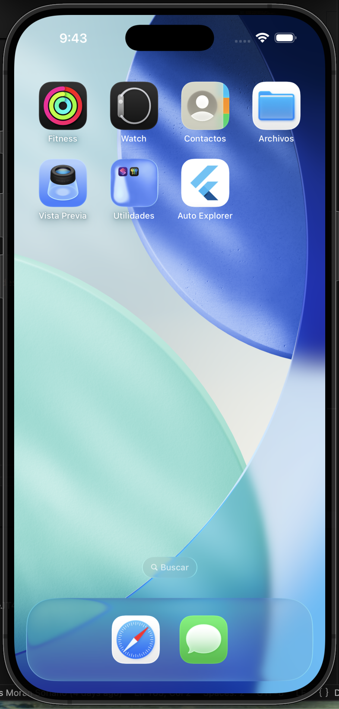

---

## 5. Desarrollo inicial

La primera versión fue desarrollada principalmente en el archivo `lib/main.dart`.

Durante esta etapa se agregaron widgets para construir la interfaz principal y se implementó una interacción básica mediante un botón.

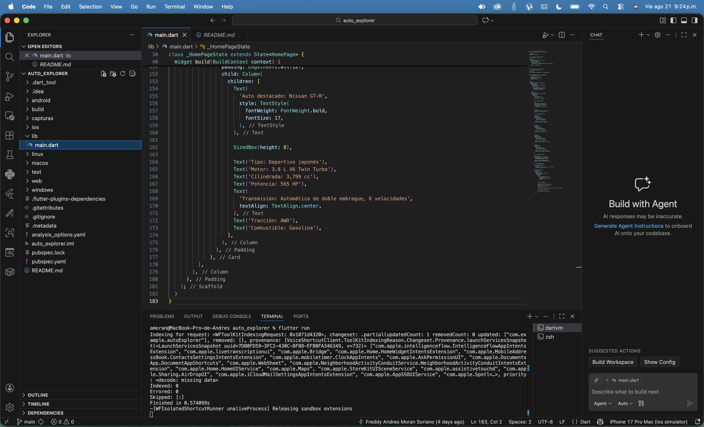

---

## 6. Pantalla principal inicial

La pantalla principal utilizó los siguientes widgets:

- `MaterialApp`
- `Scaffold`
- `AppBar`
- `Column`
- `Card`
- `ListTile`
- `Icon`
- `Text`
- `ElevatedButton`

La aplicación mostró inicialmente los siguientes vehículos:

- Toyota Supra
- Ford Mustang
- Nissan GT-R
- Chevrolet Corvette

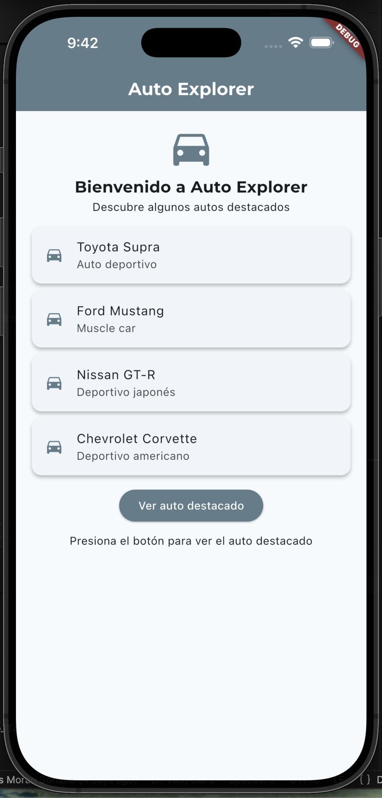

---

## 7. Interacción inicial

La aplicación incluyó el botón **Ver auto destacado**.

Al presionarlo se mostraba información adicional del Nissan GT-R, como motor, cilindrada, potencia, transmisión, tracción y combustible.

La información se actualizaba en pantalla mediante `setState()`.

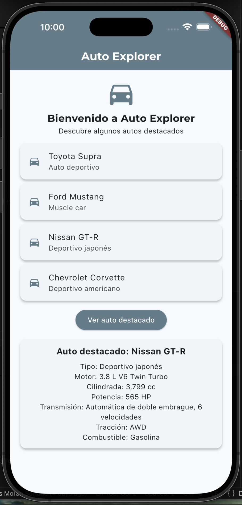

---

## 8. Instalación de Google Fonts

Para personalizar la tipografía se instaló el paquete externo `google_fonts` mediante el comando:

```bash
flutter pub add google_fonts
```

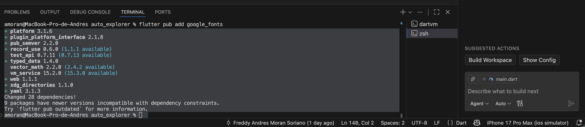

La dependencia quedó registrada en el archivo `pubspec.yaml`.

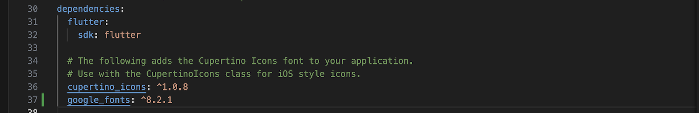

El paquete se utilizó para aplicar la fuente Montserrat y mejorar la presentación visual de los textos.

---

## 9. Aplicación ejecutándose

Después de completar la primera versión se ejecutó nuevamente el proyecto para verificar su funcionamiento.

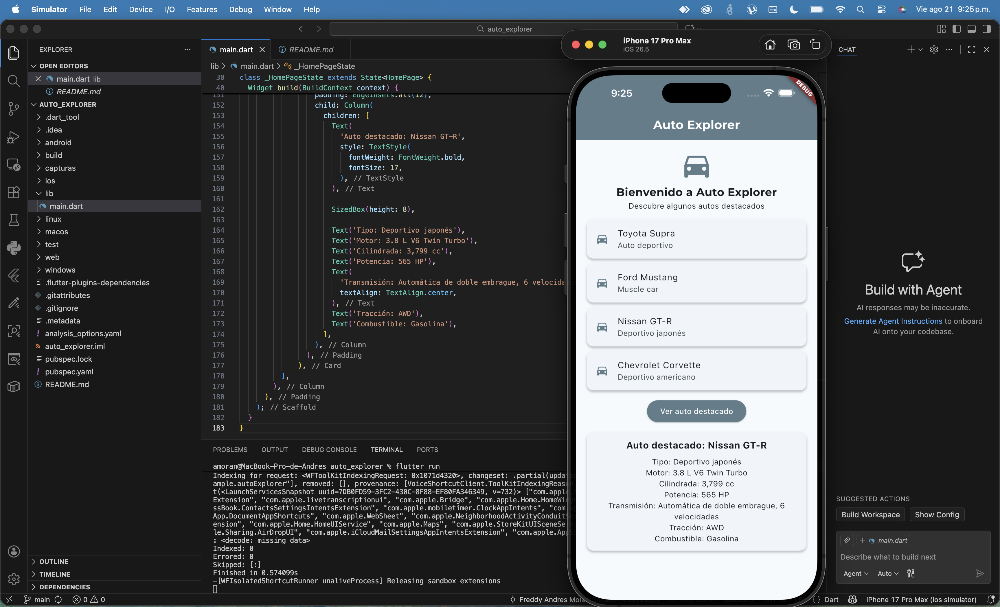

---

## 10. Publicación inicial en GitHub

El proyecto fue publicado en un repositorio público de GitHub.

Durante el desarrollo se realizaron commits para registrar progresivamente los cambios.

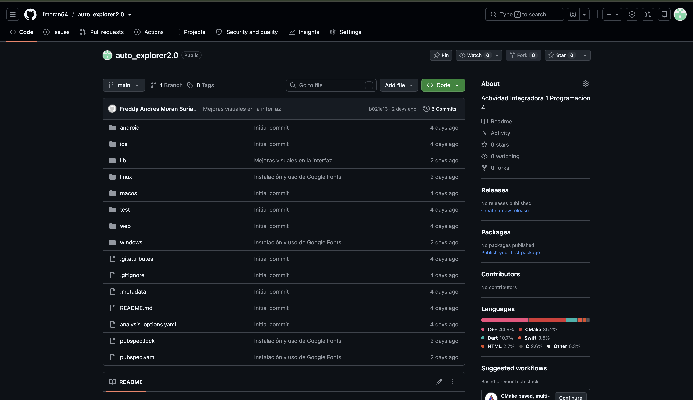

---

# Actividad Integradora 2

## 1. Continuidad del proyecto

Para la Actividad Integradora 2 se continuó mejorando la aplicación Auto Explorer creada en la actividad anterior.

La aplicación fue ampliada para incorporar una estructura de archivos organizada, cuatro pantallas, navegación mediante `Navigator`, un catálogo visual, selección de favoritos, enlaces externos, imágenes, logotipo y un ícono personalizado.

---

## 2. Nuevas funcionalidades

Las principales mejoras incorporadas fueron:

- Organización del código en carpetas y archivos independientes.
- Implementación de cuatro pantallas.
- Navegación entre pantallas mediante `Navigator`.
- Creación de un catálogo de vehículos.
- Visualización de información detallada de cada automóvil.
- Incorporación de imágenes para los vehículos.
- Funcionalidad para agregar y quitar favoritos.
- Pantalla para consultar los vehículos favoritos.
- Apertura de enlaces externos mediante `url_launcher`.
- Uso de un logotipo representativo.
- Cambio del ícono de la aplicación.
- Colores y tipografía personalizados.
- Uso de `setState()` para actualizar información en pantalla.

---

## 3. Organización del proyecto

El código fue separado en diferentes carpetas dentro de `lib` para evitar concentrar toda la aplicación en `main.dart`.

La estructura principal utilizada es la siguiente:

```text
lib/
├── data/
│   └── vehiculos_data.dart
├── models/
│   └── vehiculo.dart
├── screens/
│   ├── inicio_screen.dart
│   ├── vehiculos_screen.dart
│   ├── detalle_vehiculo_screen.dart
│   └── favoritos_screen.dart
├── theme/
│   └── app_theme.dart
├── widgets/
│   └── vehiculo_card.dart
└── main.dart
```

Cada carpeta tiene una función específica:

- `data`: contiene la información de los vehículos.
- `models`: define la estructura del modelo Vehículo.
- `screens`: contiene las diferentes pantallas.
- `theme`: contiene la configuración visual de la aplicación.
- `widgets`: contiene componentes reutilizables.
- `main.dart`: inicia la aplicación y carga la pantalla principal.

### Evidencia de la nueva estructura

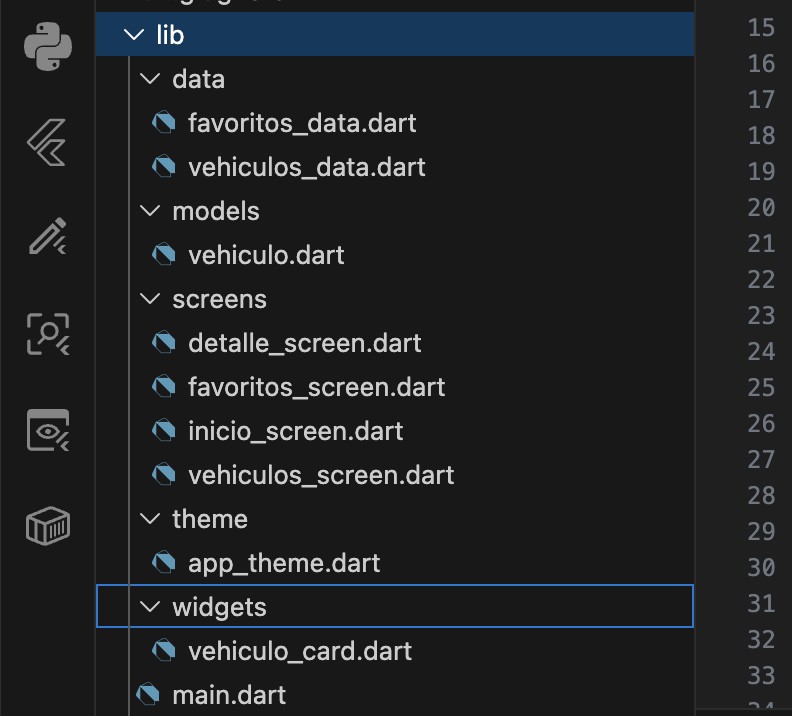

---

## 4. Pantallas desarrolladas

### 4.1. Pantalla de inicio

La pantalla de inicio presenta el logotipo de Auto Explorer, una lista de vehículos destacados y los botones principales de navegación.

Desde esta pantalla el usuario puede:

- Explorar el catálogo.
- Acceder a sus favoritos.
- Mostrar u ocultar la información del auto destacado.

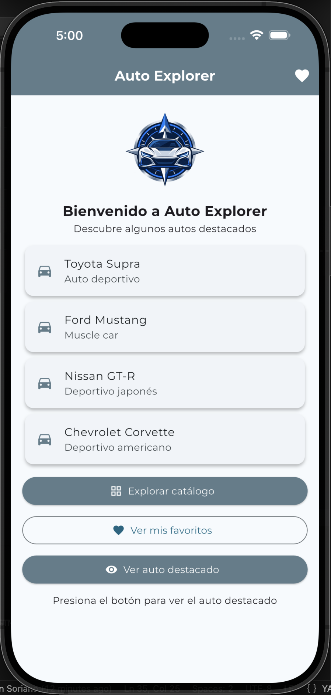

### 4.2. Pantalla de vehículos

Esta pantalla presenta el catálogo de automóviles mediante tarjetas organizadas visualmente.

Cada tarjeta contiene la imagen y la información principal del vehículo. Al seleccionar una tarjeta se abre la pantalla de detalles.

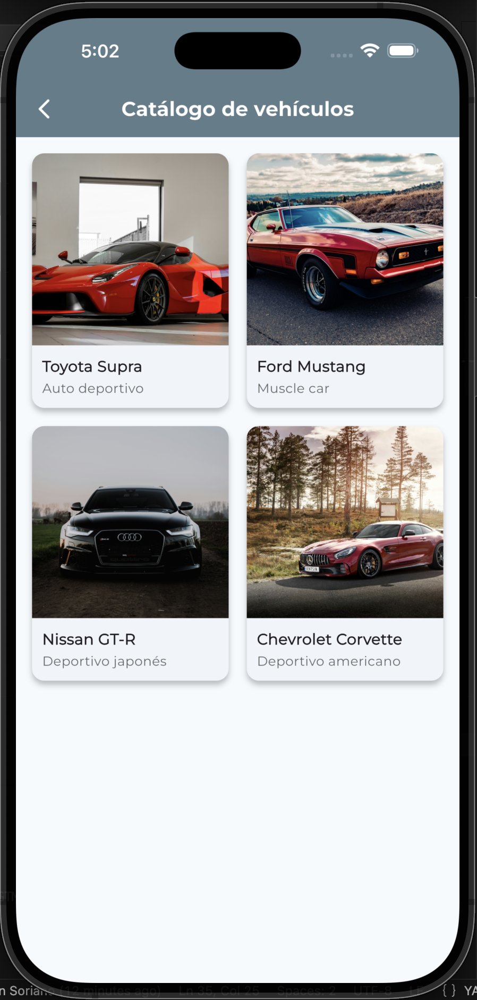

### 4.3. Pantalla de detalle

La pantalla de detalle muestra información específica del vehículo seleccionado, como:

- Nombre.
- Tipo de vehículo.
- Motor.
- Cilindrada.
- Potencia.
- Transmisión.
- Tracción.
- Combustible.

También permite agregar o quitar el vehículo de favoritos y abrir un enlace externo relacionado.

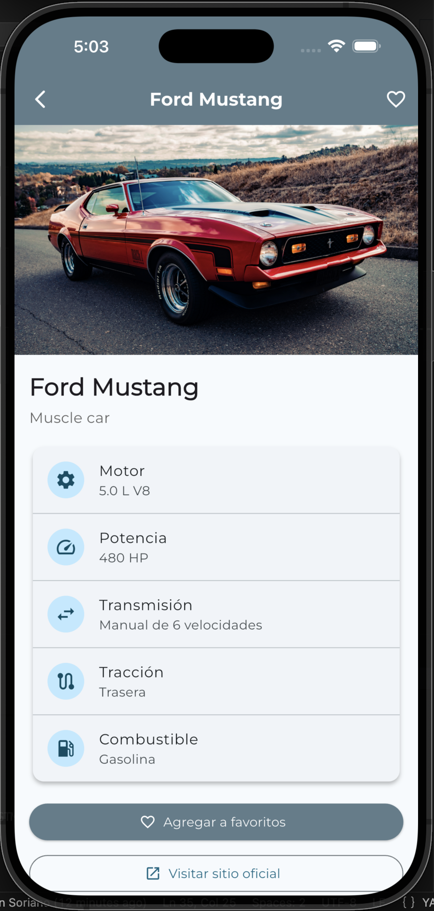

### 4.4. Pantalla de favoritos

Esta pantalla muestra los vehículos seleccionados como favoritos.

Si todavía no se han agregado vehículos, se presenta un mensaje informativo. La lista cambia cuando el usuario agrega o elimina un favorito.

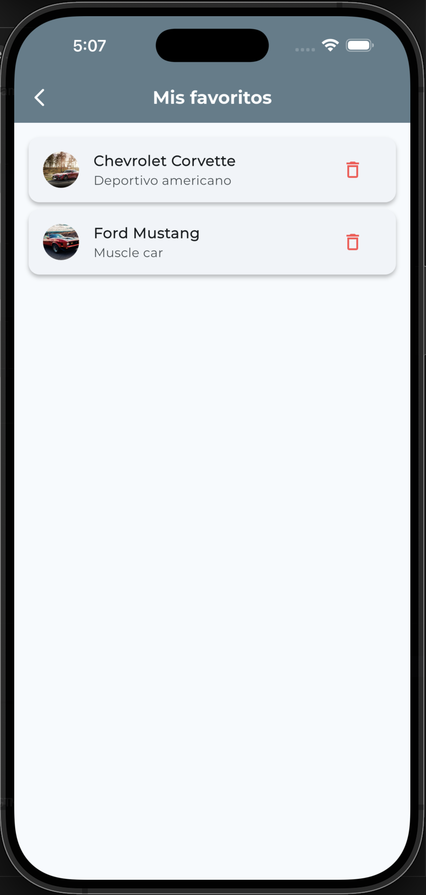

---

## 5. Navegación entre pantallas

La navegación fue implementada mediante `Navigator.push()` y `MaterialPageRoute`.

El usuario puede desplazarse desde la pantalla de inicio hacia el catálogo y los favoritos. También puede abrir la información detallada de un vehículo desde el catálogo.

Ejemplo de navegación:

```dart
Navigator.push(
  context,
  MaterialPageRoute(
    builder: (context) => const VehiculosScreen(),
  ),
);
```

La flecha de regreso proporcionada por Flutter permite volver a la pantalla anterior.

---

## 6. Widgets utilizados

Durante el desarrollo se utilizaron los siguientes widgets:

- `MaterialApp`
- `Scaffold`
- `AppBar`
- `ListView`
- `GridView`
- `ListTile`
- `Card`
- `Image`
- `Icon`
- `IconButton`
- `ElevatedButton`
- `OutlinedButton`
- `Padding`
- `SizedBox`
- `Container`
- `Center`
- `Column`
- `Row`
- `Text`

Estos widgets permiten construir la interfaz, organizar el contenido, mostrar imágenes y crear elementos interactivos.

---

## 7. Interacciones implementadas

La aplicación incorpora diferentes acciones:

### Navegación

Los botones y las tarjetas permiten navegar entre las cuatro pantallas mediante `Navigator`.

### Mostrar y ocultar información

El botón **Ver auto destacado** cambia a **Ocultar auto destacado** después de ser presionado.

### Selección de favoritos

El usuario puede agregar o quitar vehículos de su lista de favoritos.

### Apertura de enlaces externos

La pantalla de detalle permite abrir información externa relacionada con el vehículo.

### Mensajes de confirmación

La aplicación utiliza mensajes visuales para informar al usuario sobre determinadas acciones realizadas.

---

## 8. Funcionalidad con setState()

La aplicación utiliza `setState()` para cambiar información visible sin reiniciar la pantalla.

En la pantalla de inicio se utiliza una variable booleana para mostrar u ocultar la información del auto destacado:

```dart
void mostrarAutoDestacado() {
  setState(() {
    mostrarInformacion = !mostrarInformacion;
  });
}
```

Cuando el valor cambia, Flutter vuelve a construir la parte correspondiente de la interfaz.

También se actualiza el texto y el ícono del botón:

- **Ver auto destacado** cuando la información está oculta.
- **Ocultar auto destacado** cuando la información está visible.

La selección de favoritos también actualiza la interfaz para reflejar los vehículos agregados o eliminados.

---

## 9. Paquetes externos

### Google Fonts

El paquete `google_fonts` se utiliza para aplicar la fuente Montserrat y personalizar la tipografía.

```yaml
google_fonts: ^8.2.1
```

### URL Launcher

El paquete `url_launcher` se utiliza para abrir enlaces externos desde la aplicación.

```yaml
url_launcher: ^6.3.2
```

Este paquete permite conectar la aplicación con el navegador del dispositivo y consultar información relacionada con los automóviles.

### Flutter Launcher Icons

El paquete `flutter_launcher_icons` se utilizó como dependencia de desarrollo para generar el ícono de la aplicación en Android y iOS.

```yaml
flutter_launcher_icons: ^0.14.4
```

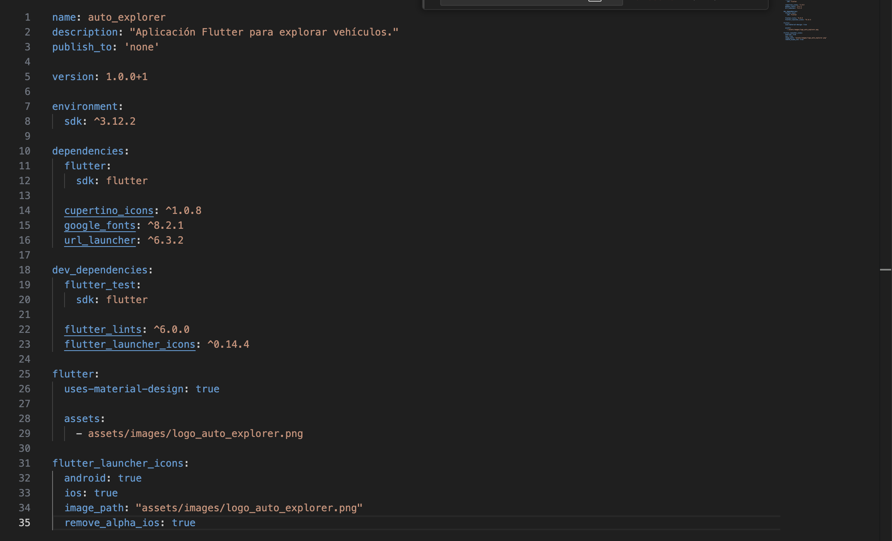

---

## 10. Personalización de la aplicación

Auto Explorer cuenta con diferentes elementos personalizados.

### Nombre

El nombre mostrado en la aplicación es **Auto Explorer**.

### Colores

Se utilizaron tonos gris azulado acordes con la temática automotriz.

### Tipografía

La fuente Montserrat fue incorporada mediante Google Fonts.

### Logotipo

Se incorporó un logotipo propio en la pantalla de inicio.

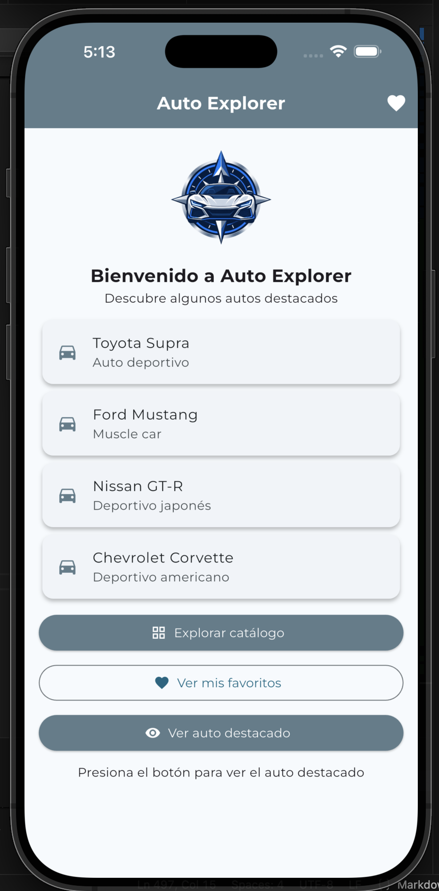

### Ícono de la aplicación

El ícono predeterminado de Flutter fue reemplazado por el logotipo de Auto Explorer mediante `flutter_launcher_icons`.

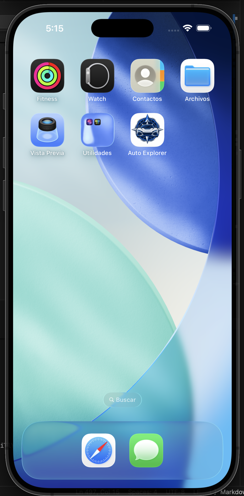

---

## 11. Ejecución del proyecto

Para ejecutar Auto Explorer se debe contar con Flutter correctamente instalado.

Primero se deben descargar las dependencias:

```bash
flutter pub get
```

Después se debe iniciar un emulador o simulador y ejecutar:

```bash
flutter run
```

También se puede ejecutar el proyecto desde Visual Studio Code seleccionando un dispositivo y utilizando la opción **Run and Debug**.

---

## 12. Control de versiones

El proyecto utiliza Git y GitHub para registrar los cambios realizados durante el desarrollo.

Se realizaron como mínimo diez commits, incluyendo avances relacionados con:

- Creación del proyecto.
- Lista inicial de vehículos.
- Mejoras visuales.
- Organización del código.
- Creación del catálogo.
- Navegación entre pantallas.
- Pantalla de detalles.
- Funcionalidad de favoritos.
- Incorporación del paquete externo.
- Incorporación del logotipo.
- Configuración del ícono de la aplicación.
- Actualización del README.

### Evidencia del historial de commits

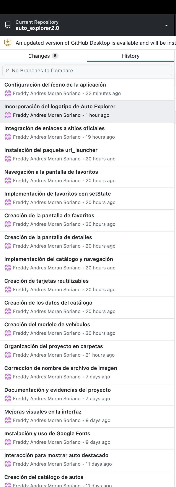

---

## Tecnologías utilizadas

- Flutter
- Dart
- Visual Studio Code
- Google Fonts
- URL Launcher
- Flutter Launcher Icons
- Git
- GitHub
- iOS Simulator

---

## Repositorio

El código fuente de Auto Explorer se encuentra publicado en GitHub:

[Repositorio Auto Explorer](https://github.com/fmoran54/auto_explorer2.0)

---

## Autor

**Freddy Andres Moran Soriano**

Programación 4